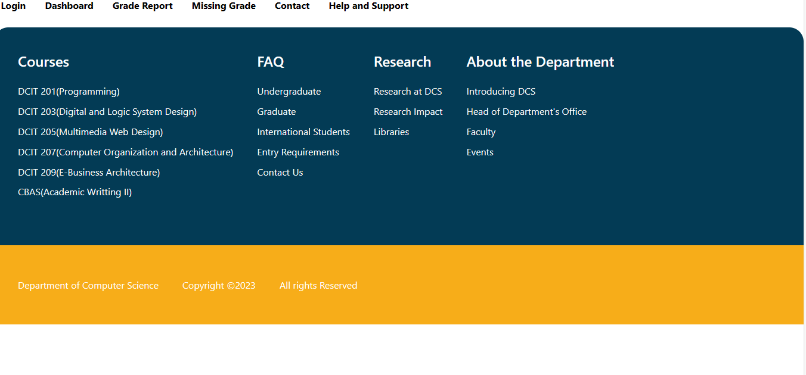

# Student Grade Reporting System Frontend

## Project Overview

This project is a front-end web application for a Student Grade Reporting System. It simulates a real-world application where students can view, report, and manage their academic grades. This system addresses the issue of missing or unrecorded grades in a student's profile.

## Application Structure

The application consists of 7 main pages:

- **Homepage:** Introduction to the system and its purpose.
- **Login Page:** Mock login interface for student authentication.
- **Dashboard:** Displays an overview of the student’s current grades and alerts for missing grades.
- **Grade Report:** Shows a detailed view of the student's grades filtered by semester or academic year.
- **Missing Grade Form:** Enables students to report missing grades.
- **Instructor Contact Page:** Lists instructors' contact information with a simulated email feature.
- **Help and Support:** Provides FAQs and a mock support contact form.

## Technical Details

- **Framework/Technology Used:** [React]
- **Responsive Design:** Implemented using [CSS Flexbox/Grid, Bootstrap, Tailwind CSS].
- **JavaScript Functionality:** Used for form validations, dynamic content rendering, and simulating interactions.

## Setup and Installation

To set up the project locally, follow these steps:

```bash
git clone https://github.com/your-github-username/DCIT_205_ASSIGNGMENT1.git
cd repo-name
npm install
npm start
```

This will start the application on `localhost` at the default port.

## Screenshots

## Login Page


## Dashboard Page


## Instructors Page


## Navbar Page




## Usage

Describe how to use the application, highlighting key functionalities such as logging in, viewing grades, reporting missing grades, and contacting instructors.

## Contribution

To contribute to this project, please follow these guidelines:

1. Fork the repository.
2. Create a new branch for your feature.
3. Commit your changes and push them to your branch.
4. Submit a pull request for review.

Please adhere to the project's coding standards and provide clear and detailed pull request descriptions.
